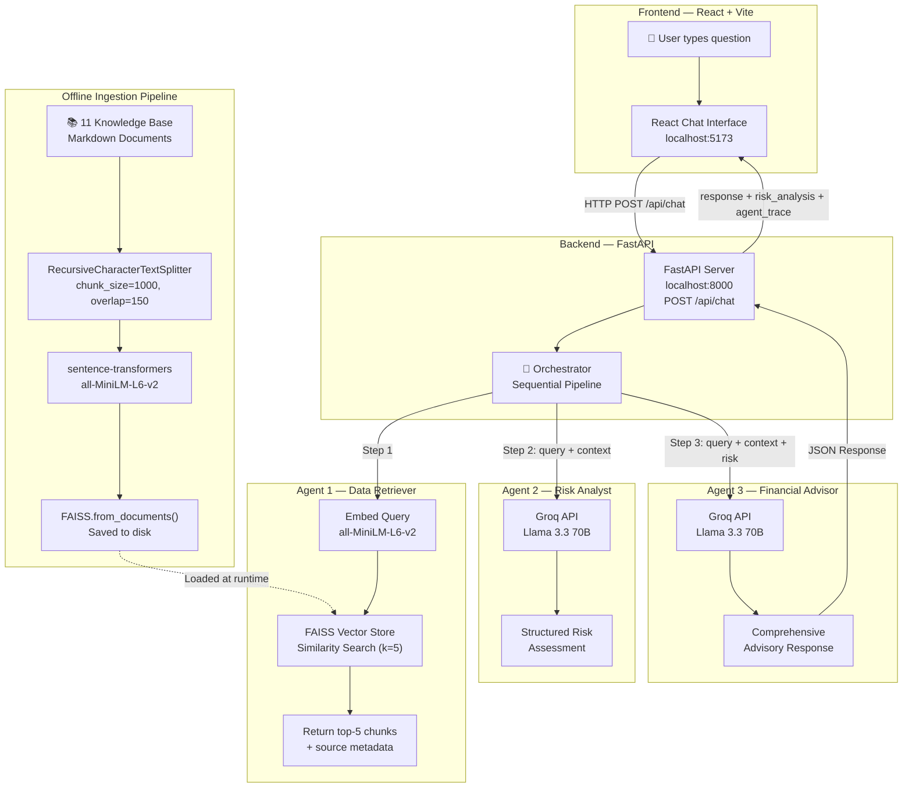
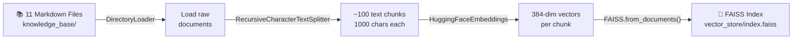
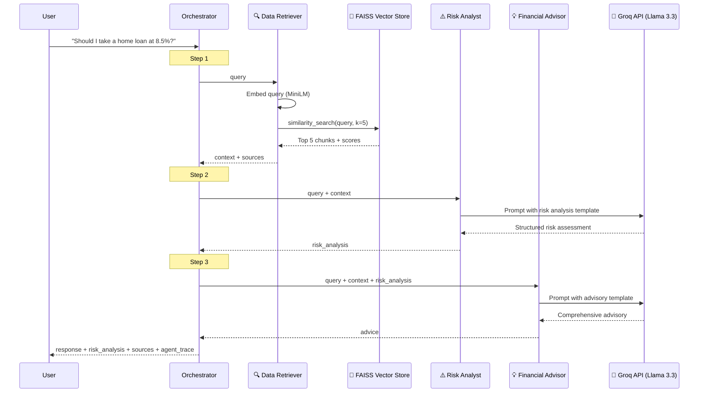
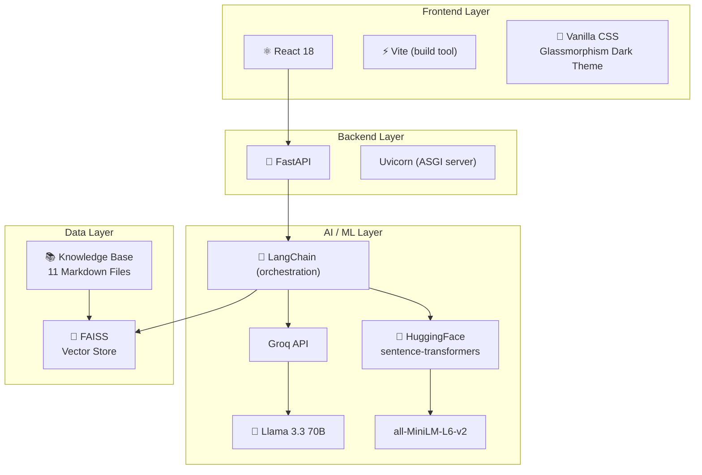

# 🏦 RAG-based Financial Advisory Assistant — Complete Interview Guide

> Everything you need to explain this project in a Gen AI interview, covering Vector Databases, Embeddings, RAG Pipelines, Agentic AI, and System Architecture.

---

## 1. One-Liner Project Summary

> "I built an **Agentic AI Financial Advisory system** that uses a **3-agent RAG pipeline** — it retrieves relevant financial documents from a **FAISS vector database** using **sentence-transformer embeddings**, then a Risk Analyst agent evaluates risks, and finally a Financial Advisor agent synthesizes a comprehensive advisory response using the **Groq/Llama 3.3** LLM."

---

## 2. System Architecture (End-to-End Flow)



---

## 3. What is RAG? (Retrieval-Augmented Generation)

**RAG** solves one of the biggest problems with LLMs: they don't know your private data.

| Problem with plain LLMs | How RAG solves it |
|---|---|
| LLMs have a knowledge cutoff date | RAG retrieves **live, up-to-date** documents |
| LLMs hallucinate facts | RAG **grounds** answers in **real retrieved data** |
| LLMs can't access private/enterprise data | RAG connects to **your own knowledge base** |
| No source citations | RAG can show **which documents** the answer came from |

### How RAG Works in This Project

```
User Question → Embed the question → Search vector DB → Get relevant chunks
     → Feed chunks + question to LLM → LLM generates answer grounded in data
```

> **Interview Tip**: "RAG combines the *retrieval* capabilities of a search engine with the *generation* capabilities of an LLM. Instead of the LLM making things up, it first retrieves relevant factual documents, then generates an answer based on those documents."

---

## 4. Embeddings — Explained in Depth

### What Are Embeddings?

Embeddings are **dense numerical vector representations** of text. They capture the **semantic meaning** of text, so similar concepts end up close together in vector space.

```
"home loan interest rate"  →  [0.23, -0.45, 0.78, ..., 0.12]  (384 dimensions)
"housing loan EMI"         →  [0.21, -0.42, 0.80, ..., 0.14]  (very similar vector!)
"best pizza in Delhi"      →  [0.91, 0.33, -0.56, ..., 0.67]  (very different vector!)
```

### Embedding Model Used: `all-MiniLM-L6-v2`

| Property | Value |
|---|---|
| Full name | `sentence-transformers/all-MiniLM-L6-v2` |
| Vector dimensions | **384** |
| Model type | Transformer (distilled from MiniLM) |
| Training | Trained on 1B+ sentence pairs |
| Where it runs | **Locally on CPU** (no API needed!) |
| Speed | Very fast (~14K sentences/sec on GPU) |

### Code reference — [ingest.py](file:///c:/Users/adity/OneDrive/Desktop/EY/backend/ingest.py#L59-L63)

```python
embeddings = HuggingFaceEmbeddings(
    model_name="sentence-transformers/all-MiniLM-L6-v2",
    model_kwargs={"device": "cpu"},
    encode_kwargs={"normalize_embeddings": True},  # L2 normalization
)
```

> **Interview Tip**: "We use `all-MiniLM-L6-v2` because it's lightweight, runs locally without GPU, produces 384-dimensional vectors, and has excellent quality for semantic search. Normalization ensures cosine similarity can be computed efficiently."

---

## 5. Vector Database — FAISS

### What Is a Vector Database?

A vector database **stores and indexes embedding vectors** so you can efficiently find the most similar vectors to a query. Unlike traditional databases that use exact keyword matching, vector DBs use **approximate nearest neighbor (ANN)** search for semantic similarity.

### Why FAISS?

| Feature | FAISS |
|---|---|
| Developed by | **Meta AI Research** (Facebook) |
| Type | In-memory vector index, stored to disk |
| Speed | Extremely fast (billion-scale search) |
| Cost | **Free & open source**, runs locally |
| Index type used | Flat L2 (exact search for small datasets) |
| Distance metric | **L2 (Euclidean distance)** |

### How FAISS Works in This Project

1. **Offline** ([ingest.py](file:///c:/Users/adity/OneDrive/Desktop/EY/backend/ingest.py)): All 11 knowledge base documents are chunked → embedded → stored in FAISS index on disk (`vector_store/index.faiss`)
2. **Runtime** ([retriever_agent.py](file:///c:/Users/adity/OneDrive/Desktop/EY/backend/agents/retriever_agent.py)): User query is embedded → FAISS does similarity search → returns top-5 most relevant chunks

### Code reference — [retriever_agent.py](file:///c:/Users/adity/OneDrive/Desktop/EY/backend/agents/retriever_agent.py#L38-L41)

```python
vector_store = get_vector_store()
results_with_scores = vector_store.similarity_search_with_score(query, k=5)
```

The score returned is L2 distance, which is converted to a similarity score:
```python
relevance_score = 1 / (1 + distance)  # 0-1 scale, higher = more similar
```

> **Interview Tip**: "We use FAISS because it's an industry-standard vector database by Meta, runs locally with zero cost, and for our knowledge base size (~11 docs, ~100 chunks), a Flat L2 index gives exact nearest-neighbor results in microseconds. For production with millions of documents, we'd switch to IVF or HNSW indexes for approximate but faster search."

---

## 6. The Ingestion Pipeline (Offline Pre-processing)

This is the **data preparation step** that runs once (`python ingest.py`) before the system can answer questions.



### Step-by-Step Breakdown

| Step | What happens | Code |
|---|---|---|
| **1. Load** | Load all [.md](file:///c:/Users/adity/OneDrive/Desktop/EY/README.md) files from `knowledge_base/` | `DirectoryLoader(glob="**/*.md")` |
| **2. Chunk** | Split docs into ~1000-char chunks with 150-char overlap | `RecursiveCharacterTextSplitter` |
| **3. Embed** | Convert each chunk to a 384-dim vector | `HuggingFaceEmbeddings` |
| **4. Store** | Build FAISS index and save to disk | `FAISS.from_documents()` → `save_local()` |

### Why Chunking?

- LLMs have **context window limits** — you can't feed entire documents
- Smaller chunks give more **precise retrieval** (retrieve only the relevant paragraph, not the whole doc)
- **Overlap (150 chars)** ensures context isn't lost at chunk boundaries

### Smart Separators

```python
separators=["\\n## ", "\\n### ", "\\n#### ", "\\n\\n", "\\n", " ", ""]
```

This tries to split at **markdown headers first** (preserving section boundaries), then paragraphs, then lines, then words — preserving semantic coherence.

### Knowledge Base Contents (11 Documents)

| Document | Topics Covered |
|---|---|
| [home_loans.md](file:///c:/Users/adity/OneDrive/Desktop/EY/backend/knowledge_base/home_loans.md) | Interest rates, eligibility, EMI calculation, tax benefits |
| [personal_loans.md](file:///c:/Users/adity/OneDrive/Desktop/EY/backend/knowledge_base/personal_loans.md) | Unsecured loans, rates, eligibility |
| [education_loans.md](file:///c:/Users/adity/OneDrive/Desktop/EY/backend/knowledge_base/education_loans.md) | Education financing, schemes |
| [credit_score.md](file:///c:/Users/adity/OneDrive/Desktop/EY/backend/knowledge_base/credit_score.md) | CIBIL score factors, improvement tips |
| [investment_options.md](file:///c:/Users/adity/OneDrive/Desktop/EY/backend/knowledge_base/investment_options.md) | FD, MF, PPF, NPS, Gold |
| [mutual_funds_sip.md](file:///c:/Users/adity/OneDrive/Desktop/EY/backend/knowledge_base/mutual_funds_sip.md) | SIP vs lumpsum, fund types |
| [insurance.md](file:///c:/Users/adity/OneDrive/Desktop/EY/backend/knowledge_base/insurance.md) | Life + Health insurance |
| [tax_planning.md](file:///c:/Users/adity/OneDrive/Desktop/EY/backend/knowledge_base/tax_planning.md) | Section 80C, 80D, tax-saving |
| [banking_services.md](file:///c:/Users/adity/OneDrive/Desktop/EY/backend/knowledge_base/banking_services.md) | Account types, banking features |
| [rbi_guidelines.md](file:///c:/Users/adity/OneDrive/Desktop/EY/backend/knowledge_base/rbi_guidelines.md) | RBI monetary policy, regulations |
| [risk_assessment.md](file:///c:/Users/adity/OneDrive/Desktop/EY/backend/knowledge_base/risk_assessment.md) | Risk framework and factors |

---

## 7. The 3-Agent RAG Pipeline (Runtime)

This is the **Agentic AI** part — three specialized agents work sequentially:

### Agent Pipeline Flow



---

### Agent 1: Data Retriever (No LLM needed)

**Purpose**: Find the most relevant financial information for the user's question

| Aspect | Details |
|---|---|
| LLM used | **None** — pure vector similarity search |
| Input | User query |
| Process | Embed query → FAISS search → return top-5 chunks |
| Output | Combined context string + source file names + relevance scores |

**Key code** — [retriever_agent.py](file:///c:/Users/adity/OneDrive/Desktop/EY/backend/agents/retriever_agent.py)

---

### Agent 2: Risk Analyst (LLM Agent)

**Purpose**: Evaluate financial risks in the user's decision

| Aspect | Details |
|---|---|
| LLM used | **Llama 3.3 70B** via Groq API |
| Input | User query + retrieved context from Agent 1 |
| Temperature | 0.3 (more deterministic, factual) |
| Output format | Structured: Risk Category, Risk Level, Key Factors, Mitigation Suggestions, Warnings |

**Prompt engineering**: Uses `ChatPromptTemplate` with a system message defining the risk analyst persona and a strict output format.

**Key code** — [risk_agent.py](file:///c:/Users/adity/OneDrive/Desktop/EY/backend/agents/risk_agent.py)

---

### Agent 3: Financial Advisor (LLM Agent)

**Purpose**: Generate the final comprehensive advisory response

| Aspect | Details |
|---|---|
| LLM used | **Llama 3.3 70B** via Groq API |
| Input | User query + retrieved context + risk analysis from Agent 2 |
| Temperature | 0.5 (balanced creativity and accuracy) |
| Output | Comprehensive financial advice with recommendations |

**Key code** — [advisor_agent.py](file:///c:/Users/adity/OneDrive/Desktop/EY/backend/agents/advisor_agent.py)

---

### The Orchestrator — [orchestrator.py](file:///c:/Users/adity/OneDrive/Desktop/EY/backend/agents/orchestrator.py)

The orchestrator is a **sequential pipeline coordinator** that:
1. Runs Agent 1 → gets context
2. Passes context to Agent 2 → gets risk analysis
3. Passes context + risk to Agent 3 → gets advisory
4. Compiles everything + timestamps into the final response
5. Returns **agent_trace** (execution log of all 3 agents with timing)

---

## 8. LLM & API Layer

### Groq + Llama 3.3 70B

| Property | Value |
|---|---|
| LLM Provider | **Groq** (ultra-fast inference) |
| Model | **Llama 3.3 70B Versatile** (by Meta) |
| Why Groq? | **Free tier**, blazing fast (~500 tokens/sec via custom LPU hardware) |
| Framework | LangChain (`ChatGroq` wrapper) |
| API Key stored in | [backend/.env](file:///c:/Users/adity/OneDrive/Desktop/EY/backend/.env) → `GROQ_API_KEY` |

### LangChain Usage

The project uses LangChain in two ways:
1. **Embedding + Vector Store**: `HuggingFaceEmbeddings` + `FAISS` classes
2. **LLM Chains**: `ChatPromptTemplate | ChatGroq` — the `|` operator creates a LangChain "chain" that pipes the prompt template into the LLM

```python
chain = RISK_ANALYSIS_PROMPT | llm   # LangChain Expression Language (LCEL)
response = chain.invoke({"query": query, "context": context})
```

---

## 9. Backend Architecture (FastAPI)

[main.py](file:///c:/Users/adity/OneDrive/Desktop/EY/backend/main.py) — The REST API server

| Endpoint | Method | Purpose |
|---|---|---|
| `/api/chat` | POST | Main endpoint — sends query through 3-agent pipeline |
| `/api/health` | GET | Health check — verifies API key + vector store status |
| `/api/suggested-questions` | GET | Returns 6 pre-defined starter questions |

### Request/Response Flow

```
POST /api/chat
Body: { "query": "Should I take a home loan?" }

Response: {
    "success": true,
    "query": "Should I take a home loan?",
    "response": "Based on current rates...",        ← Agent 3 output
    "risk_analysis": "Risk Level: Moderate...",      ← Agent 2 output
    "sources": ["Home Loans", "Credit Score"],        ← Agent 1 sources
    "chunks_retrieved": 5,
    "agent_trace": [...],                             ← All 3 agents' logs
    "total_duration_ms": 4200
}
```

---

## 10. Frontend Architecture (React + Vite)

| Component | Purpose |
|---|---|
| [App.jsx](file:///c:/Users/adity/OneDrive/Desktop/EY/frontend/src/App.jsx) | Main app — chat interface, state management, API calls |
| [ChatMessage.jsx](file:///c:/Users/adity/OneDrive/Desktop/EY/frontend/src/components/ChatMessage.jsx) | Renders user/AI messages with markdown formatting |
| [AgentTrace.jsx](file:///c:/Users/adity/OneDrive/Desktop/EY/frontend/src/components/AgentTrace.jsx) | Expandable panel showing all 3 agents' execution details |
| [SuggestedQuestions.jsx](file:///c:/Users/adity/OneDrive/Desktop/EY/frontend/src/components/SuggestedQuestions.jsx) | Clickable starter question cards |

### Key UX Features
- **Dark/Light theme toggle** with glassmorphism design
- **Simulated agent progression** (shows which agent is running during loading)
- **Backend health monitoring** (checks `/api/health` every 15 seconds)
- **Markdown rendering** in AI responses (headers, bold, lists, tables, code)
- **Agent trace panel** — shows individual agent execution times and details

---

## 11. Tech Stack Summary



---

## 12. Interview Q&A Cheat Sheet

### ❓ "What is RAG and why did you use it?"

> "RAG stands for Retrieval-Augmented Generation. Instead of relying solely on the LLM's pre-trained knowledge (which can hallucinate), we first **retrieve** relevant documents from our own knowledge base, then feed those documents as context to the LLM to **generate** an answer grounded in factual data. This reduces hallucination and lets us use domain-specific financial information."

### ❓ "What is a vector database?"

> "A vector database stores data as high-dimensional numerical vectors (embeddings) and enables fast similarity search. Unlike a traditional SQL database that does exact keyword matching, a vector DB finds **semantically similar** content. So if I search for 'housing EMI', it can find documents about 'home loan monthly payments' even though the exact words don't match. We used **FAISS** by Meta, which is an in-memory vector index stored to disk."

### ❓ "Explain embeddings."

> "Embeddings are dense numerical vectors (like an array of 384 float numbers) that represent the semantic meaning of text. They're generated by a transformer neural network — in our case, `all-MiniLM-L6-v2`. The key property is that **semantically similar text produces similar vectors**. We measure similarity using L2 (Euclidean) distance in our FAISS index."

### ❓ "How does your RAG pipeline work step by step?"

> "It's a 3-agent sequential pipeline:
> 1. **Data Retriever** — embeds the user query using MiniLM, searches FAISS for the top-5 most similar document chunks, returns them as context
> 2. **Risk Analyst** — sends the query + retrieved context to Llama 3.3 (via Groq) with a risk analysis prompt, returns a structured risk assessment
> 3. **Financial Advisor** — sends the query + context + risk analysis to Llama 3.3 with an advisory prompt, returns the final comprehensive response
> Each agent's output feeds into the next one sequentially."

### ❓ "What is Agentic AI? How is your system agentic?"

> "Agentic AI means the system uses **autonomous agents** that each have a specific role and expertise. Instead of one monolithic LLM call, we have 3 specialized agents — a retriever, a risk analyst, and an advisor — coordinated by an orchestrator. Each agent has its own prompt/persona, makes independent decisions, and its output cascades to the next agent. This gives us separation of concerns and better quality."

### ❓ "Why not just use one LLM call?"

> "Three agents give us: (1) **Separation of concerns** — each agent is specialized with its own prompt template, (2) **Better quality** — the risk analysis is done independently and then used to inform the advisory, (3) **Transparency** — we can show users exactly which agent did what via the agent trace, (4) **Debugging** — if advice is bad, we can pinpoint which agent failed."

### ❓ "Why FAISS over Pinecone/Chroma/Weaviate?"

> "FAISS is ideal for this use case: (1) it's **free and open-source** by Meta, (2) our knowledge base is small (~100 chunks), so we don't need a hosted cloud vector DB, (3) it runs entirely **locally** with zero latency, (4) it's the **industry standard** for similarity search. For production with millions of documents, we'd consider Pinecone (managed) or Milvus (self-hosted)."

### ❓ "Why Groq + Llama instead of OpenAI GPT?"

> "Groq provides a **free tier** with blazing-fast inference (~500 tokens/sec) using custom LPU hardware. Llama 3.3 70B is Meta's open-source model that's competitive with GPT-4 on many benchmarks. This gives us **zero API cost** during development while maintaining high quality."

### ❓ "What is chunking and why is it needed?"

> "Chunking means splitting documents into smaller pieces (we use 1000 characters with 150-character overlap). It's needed because: (1) LLMs have context window limits, (2) smaller chunks give more precise retrieval — you get the specific paragraph about 'home loan tax benefits' instead of the entire home loan document, (3) overlap ensures context isn't lost at boundaries."

### ❓ "How would you scale this to production?"

> "For production: (1) Replace FAISS with **Pinecone** or **Milvus** for managed vector storage, (2) Add **caching** for frequent queries, (3) Use **async/parallel** agent execution where possible, (4) Add **user authentication**, (5) Implement **feedback loops** to improve retrieval quality, (6) Add **guardrails** for content safety, (7) Use a **message queue** (Celery/RabbitMQ) for heavy workloads."

### ❓ "What LangChain features did you use?"

> "We used: (1) **Document Loaders** — `DirectoryLoader` to load markdown files, (2) **Text Splitter** — `RecursiveCharacterTextSplitter` for intelligent chunking, (3) **Embeddings** — `HuggingFaceEmbeddings` wrapper, (4) **Vector Store** — `FAISS` integration, (5) **Chat Prompts** — `ChatPromptTemplate` for agent prompts, (6) **LCEL (LangChain Expression Language)** — the `|` pipe operator to chain prompts with LLMs."

### ❓ "What is similarity search?"

> "It's the process of finding vectors in the database that are closest to the query vector. We use L2 (Euclidean) distance — smaller distance means more similar. FAISS computes this efficiently even for millions of vectors using optimized CPU/GPU operations."

---

## 13. Project File Structure Reference

```
EY/
├── backend/
│   ├── agents/
│   │   ├── orchestrator.py      ← Pipeline coordinator (3-step sequential)
│   │   ├── retriever_agent.py   ← Agent 1: FAISS vector search (no LLM)
│   │   ├── risk_agent.py        ← Agent 2: Risk analysis (Groq/Llama)
│   │   ├── advisor_agent.py     ← Agent 3: Advisory generation (Groq/Llama)
│   │   └── __init__.py
│   ├── knowledge_base/           ← 11 curated financial Markdown documents
│   ├── vector_store/             ← FAISS index (generated by ingest.py)
│   ├── main.py                   ← FastAPI server (3 endpoints)
│   ├── ingest.py                 ← Offline ingestion: Load → Chunk → Embed → Store
│   ├── requirements.txt          ← Python dependencies
│   └── .env                      ← GROQ_API_KEY
├── frontend/
│   ├── src/
│   │   ├── App.jsx               ← Main chat app (state, API calls, UI)
│   │   ├── components/
│   │   │   ├── ChatMessage.jsx   ← Message renderer with markdown support
│   │   │   ├── AgentTrace.jsx    ← Expandable agent pipeline details
│   │   │   └── SuggestedQuestions.jsx
│   │   ├── index.css             ← Full styling (glassmorphism dark theme)
│   │   └── main.jsx              ← React entry point
│   └── index.html
└── README.md
```
